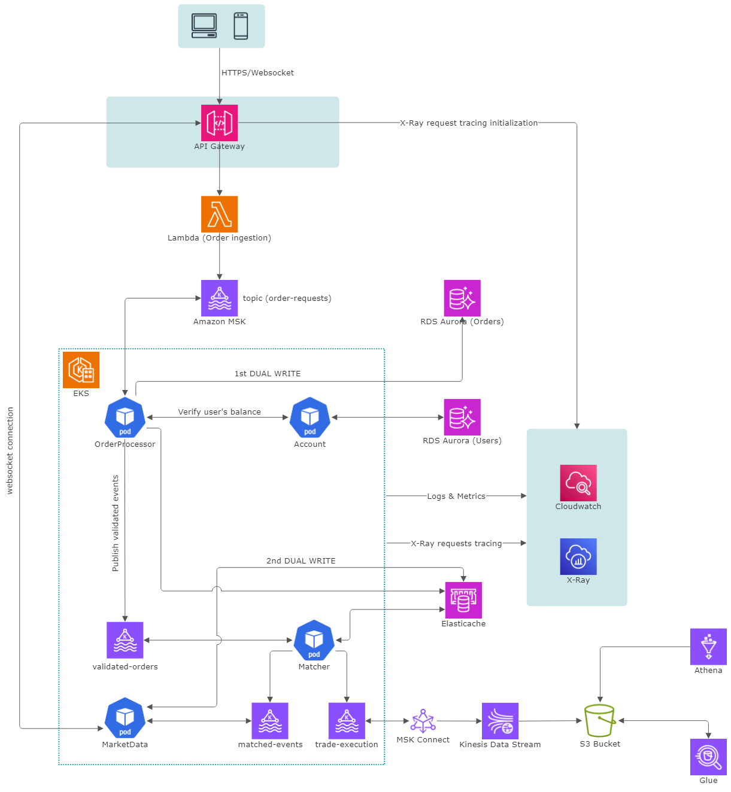

## Highly Available Trading System Architecture

This document outlines the architecture for a core feature of trading system (**spot trading**), focusing on scalability, resilience, and cost-effectiveness.

### 1. Spot Trading core feature architecture

### 2. Components and Overall Flow

In this part, we describe all components in the architecture and explain the lifecycle of a buy/sell order in the trading system architecture, from submission to confirmation.

**1. User Interaction (Web/Mobile App):**

* User submits a buy/sell order via the trading platform's front-end application.

**2. HTTPS/WebSocket Connection:**

* Secure connection (HTTPS or WebSocket) established between the user's application and the API Gateway.

**3. API Gateway:**

* **Authentication:** Verifies user identity.
* **Authorization:** Checks trading permissions.
* **Rate Limiting:** Prevents abuse.
* **Request Routing:** Routes the request to the Lambda (Order Ingestion).
* **X-Ray Tracing:** Initiates request tracing.

**4. Lambda (Order Ingestion):**

* Receives the request.
* **Data Transformation:** Converts request data to a standard format.
* **Message Publishing:** Publishes the order message to the `order-requests` MSK topic.

**5. Amazon MSK (order-requests topic):**

* Order message is durably stored in the `order-requests` topic.

**6. EKS (Order Processor - Pod):**

* Consumes messages from `order-requests`.
* **Order Validation:** Performs validation checks.
* **Balance Check:** Interacts with RDS Aurora (Account) for balance verification.
* **Dual Write (Aurora First):** If the order is valid:
    * **a) Write to RDS Aurora (Account - Warm Order Book):** *First*, writes the order details to the Warm Order Book in RDS Aurora.
    * **b) Write to ElastiCache:** *After* successful Aurora write, writes to ElastiCache (Hot Order Book).
    * **c) Publish to MSK (validated-orders topic):** *Finally*, publishes the validated order to the `validated-orders` topic.

**7. EKS (Matcher - Pod):**

* Consumes messages from `validated-orders`.
* **Order Matching:** Retrieves order book data from ElastiCache.
* **Match Execution:** If a match is found:
    * **a) Publish `matched-events`:** Publishes to the `matched-events` MSK topic.
    * **b) Publish `trade-execution`:** Publishes to the `trade-execution` MSK topic.

**8. EKS (Market Data - Pod):**

* Subscribes to `matched-events` and `trade-execution`.
* **Market Data Updates:** Updates its internal market data representation.
* **WebSocket Updates:** Pushes updates to clients via WebSockets.

**9. ElastiCache:**

* Used by the Matcher for fast order book access.

**10. RDS Aurora (Account):**

* Stores user account information and serves as the Warm Order Book.

**11. Amazon MSK Connect:**

* Streams data from `trade-execution` to other systems.

**12. Kinesis Data Stream:**

* Receives `trade-execution` stream for analytics.

**13. S3 Bucket:**

* Stores historical trade data.

**14. Glue:**

* Used for data processing in S3.

**15. CloudWatch:**

* Collects logs and metrics.

**16. X-Ray:**

* Provides distributed tracing.

**17. Client (WebSocket Connection):**

* Maintains a WebSocket connection for updates.

**18. Trade Confirmation:**

* Client receives confirmation via WebSocket.

### 3. Elaboration on Cloud Services and Alternatives

| Service                     | Role                                                                    | Why Chosen                                                                                                                              | Alternatives Considered                                                              |
| --------------------------- | ----------------------------------------------------------------------- | ------------------------------------------------------------------------------------------------------------------------------------- | --------------------------------------------------------------------------------- |
| Amazon API Gateway          | Entry point, authentication, authorization, rate limiting, WebSocket management | Scalable, managed, integrates well with AWS, handles WebSockets.                                                                         | Nginx, HAProxy, custom solutions                                                    |
| Amazon MSK                  | High-throughput message queue                                           | Managed Kafka, high throughput, fault-tolerant, ordered messaging.                                                                      | RabbitMQ, ActiveMQ, self-managed Kafka                                            |
| Amazon ElastiCache (Redis) | In-memory data store for the order book                                 | Fast, supports sorted sets, scalable.                                                                                                    | Memcached, self-managed Redis                                                        |
| Amazon S3                   | Storage for historical trade data                                       | Cost-effective, scalable, durable.                                                                                                     | Self-managed storage, other cloud storage                                          |
| Amazon Athena/Glue          | Query and analysis of historical data                                  | Serverless, integrates with S3, SQL queries.                                                                                            | Self-managed query engines, other data warehousing                               |
| Amazon RDS Aurora           | Relational database for user accounts                                   | Managed, highly available, scalable, ACID compliant.                                                                                     | Other relational databases                                                          |
| Amazon Kinesis Data Streams | Real-time streaming of trade data                                       | Scalable, managed streaming.                                                                                                          | Self-managed Kafka                                                                |
| Amazon ECS/EKS/Lambda       | Compute platform for services                                           | Flexible, containerization (ECS/EKS), serverless (Lambda).                                                                               | EC2 instances, other container orchestration platforms                               |
| Amazon CloudWatch           | Monitoring and logging                                                   | Managed, integrates with AWS.                                                                                                         | Self-managed monitoring tools                                                    |
| AWS X-Ray                   | Distributed tracing                                                     | Managed, integrates with AWS.                                                                                                          | Opentelemetry, Jaeger, Zipkin                                                                     |
### 4. Trading System Architecture - Autoscaling Strategy (EKS Focus)

**Overall Architecture (Components):**

The architecture includes the following key components:

* Clients (Web/Mobile)
* API Gateway
* Lambda (Order Ingestion)
* MSK (Message Queue)
* EKS (Order Processing, Matching Engine, Market Data)
* ElastiCache
* RDS Aurora (Account, Warm Order Book)
* Kinesis Data Stream
* S3 Bucket
* Glue
* CloudWatch
* X-Ray

**EKS Node Scaling:**

* **Strategy:** Karpenter/Cluster Autoscaler
* **Description:** The Karpenter or Cluster Autoscaler automatically manages the number of worker nodes in the EKS cluster. It provisions new nodes when pods are pending due to insufficient resources and scales down when nodes are underutilized. But Karpenter is preferred because it is a flexible and efficient node provisioning tool for EKS.  It directly provisions EC2 instances based on the requirements of pending pods, bypassing the need for a managed node group. This allows for more granular control and faster scaling compared to managed node groups or the Cluster Autoscaler.
* **Configuration:**
    * Define minimum and maximum number of nodes.
    * Specify instance types for worker nodes.
    * Configure scaling thresholds (e.g., CPU utilization, memory pressure).
* **Scaling Metrics:**
    * Number of pending pods.
    * Overall cluster resource utilization.
**EKS Pod Scaling:**

* **Combined Strategy:** Horizontal Pod Autoscaler (HPA) *and* Vertical Pod Autoscaler (VPA)

* **Horizontal Pod Autoscaler (HPA):**
    * **Description:** Scales the *number* of pods based on metrics.
    * **Configuration:** Define target resource utilization, min/max pods, thresholds.
    * **Scaling Metrics:** CPU utilization, memory usage, custom metrics.

* **Vertical Pod Autoscaler (VPA):**
    * **Description:** Recommends and/or automatically adjusts the CPU and memory *requests and limits* of pods.  It ensures that each pod has enough resources to operate efficiently.
    * **Modes:**
        * **Off:** VPA only provides recommendations.
        * **Auto:** VPA automatically updates pod resource requests and limits.
        * **Initial:** VPA sets initial resource requests and limits for new pods based on historical data and then continues to provide recommendations.
    * **Recommendation:** Use `Auto` or `Initial` mode for production.
    * **Benefits:** Prevents resource starvation, optimizes resource utilization.
    * **Considerations:** Can lead to pod restarts if resource limits are changed in `Auto` mode.
  
* **Kubernetes Event-driven Autoscaler (KEDA):**
    * **Description:** Scales the number of pods based on events from various sources (e.g., message queues like Kafka, metrics from Prometheus, etc.).
    * **Benefits:** Enables scaling based on events, not just resource utilization.  This is particularly useful for event-driven workloads.
    * **Scalers:** KEDA uses "Scalers" to connect to different event sources.  You configure the appropriate scaler for your event source (e.g., Kafka scaler, Prometheus scaler).
    * **Triggers:** Define "Triggers" in your deployments to specify the scaling behavior based on the events.  You can define thresholds, polling intervals, and other parameters.

**General Autoscaling Strategy:**

1. **API Gateway:**
    * **Strategy:** Automatic scaling based on request volume.
    * **Consideration:** Configure rate limiting to prevent abuse.

2. **Lambda (Order Ingestion):**
    * **Strategy:** Automatic scaling based on invocations.
    * **Consideration:** Configure concurrency limits.

3. **MSK (Message Queue):**
    * **Strategy:** Provisioning based on anticipated throughput.
    * **Consideration:** Monitor consumer lag.

4. **ElastiCache:**
    * **Strategy:** Vertical scaling (change instance size) or horizontal scaling (add read replicas) depending on needs.
    * **Consideration:** Monitor CPU, memory, and cache hit ratio.

5. **RDS Aurora:**
    * **Strategy:** Auto-scaling read replicas, manual scaling for the primary instance.
    * **Consideration:** Monitor CPU, connections, and storage.

6. **Kinesis Data Stream:**
    * **Strategy:** Scaling by adjusting the number of shards.
    * **Consideration:** Based on data ingestion rate.

7. **Glue:**
    * **Strategy:** Automatic scaling based on job requirements.

**Example Scenario (EKS Pod Scaling):**

* A service (e.g., Order Processor) experiences increased load.
* The HPA detects high CPU utilization.
* The HPA increases the number of pods for that service.
* The new pods handle the increased load.

**Example Scenario (Scaling based on Kafka messages (KEDA)):**

1. Configure a Kafka scaler in KEDA to connect to your MSK topic.
2. Define a trigger in your deployment that specifies the desired number of pods based on the number of messages in the Kafka topic.
3. KEDA monitors the number of messages in the topic.
4. If the number of messages exceeds the threshold, KEDA scales up the number of pods.
5. When the number of messages decreases, KEDA scales down the pods.

**Example Scenario (EKS Node Scaling with Karpenter):**

1. Pods are deployed with annotations specifying their resource requirements.
2. Karpenter observes the pending pods and their requirements.
3. Karpenter provisions new EC2 instances based on the defined Provisioners and the pod requirements.
4. The pods are scheduled onto the newly provisioned instances.

**General Considerations:**

* **Monitoring & Alerting:** Implement monitoring and alerting for scaling metrics.
* **Load Testing:** Conduct load testing to fine-tune autoscaling configurations.
* **Capacity Planning:** Proactively plan for growth.

This document provides a general autoscaling strategy. Adapt it to your specific application requirements. Continuous monitoring and adjustment are essential.
