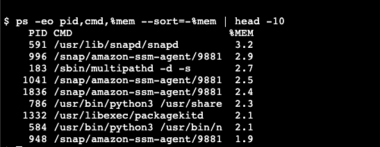
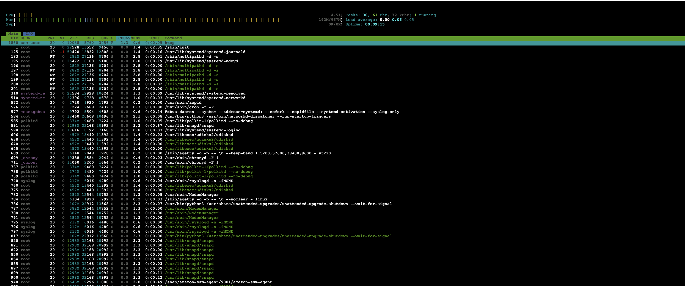
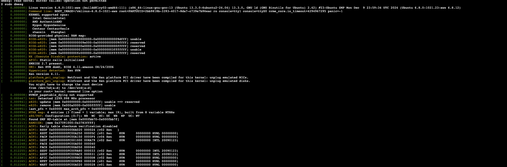

# Troubleshooting High Memory Usage on NGINX Load Balancer VM

## 1. Initial Investigation
**Check status of NGINX**
```bash
sudo systemctl status nginx
```

**Examine NGINX logs for errors or unusual activity**
```bash
sudo journalctl -u nginx
```
Example output:


**Check NGINX logs for anomalies**
```bash
# Get last 100 lines from file error.log
tail -n 100 /var/log/nginx/error.log
# Get lass 100 lines from file access.log
tail -n 100 /var/log/nginx/access.log
```

Example output:


**Check any included configuration files**
```bash
ls -la /etc/nginx/conf.d/*
cat /etc/nginx/conf.d/*
```

**Check overall memory usage to show the total, used, and available memory**
```bash
free -m
```

The output should look like image below:


**Identify high-memory processes** by using some common commands such as `top`, `htop`, `ps`. Example with `ps` command:
```bash
ps -eo pid,cmd,%mem --sort=-%mem | head -10
```

The output should look like image below:



Or if you want to run with `top` or `htop` command, the output will look like this:




**Inspect swap usage**
```bash
swapon --summary
```
If swap is heavily used, it may indicate memory exhaustion.

**Check disk space utilization**
Although the scenario mentions 64GB, a full disk can sometimes indirectly contribute to memory issues. Command to check disk utilization:
```bash
df -h
```
Example output:


**Check system uptime**
A recent restart might indicate a different issue than long-running high usage.

```bash
uptime
```
Example output:


**Check the system logs for any kernel errors**
To protect the system, The OOM killer will terminate processes to free up memory, so it could be important event for the investigation.
```bash
sudo dmesg
```
Example output:


## 2. Potential Root Causes & Fixes
### 2.1. NGINX Worker Processes Using Excessive Memory
**Possible Cause**: Misconfigured worker processes consuming more memory than needed
**How to fix:**
Check worker process settings:
```bash
grep worker_processes /etc/nginx/nginx.conf
```
Example output:


Adjust based on CPU cores by adding corresponding setting in file `/etc/nginx/nginx.conf`:
```bash
worker_processes auto;
worker_rlimit_nofile 100000;
worker_connections 8192;
```

Reload NGINX:
```bash
sudo systemctl reload nginx
```

### 2.2. Connection Overload & Keepalive Misconfiguration
**Possible Cause**: High concurrent connections without optimized settings.
**How to fix:**
Tune keepalive settings:
```bash
keepalive_timeout 10;
keepalive_requests 100;
```

Reduce memory usage per request:
```bash
client_body_buffer_size 512k;
client_max_body_size 10m;
large_client_header_buffers 4 8k;
```

### 2.3. NGINX Memory Leaks or Third-Party Modules
**Possible Cause:** Faulty modules or unpatched memory leaks.
**How to fix:**
Restart NGINX to check if memory usage resets:
```bash
sudo systemctl restart nginx
```

List loaded modules:
```bash
nginx -V 2>&1 | tr -- - '\n' | grep _module
```
Example output:


Update Nginx:
```
sudo apt update && sudo apt upgrade nginx -y
```

### 2.4. Excessive Logging Consuming Memory
**Possible Cause:** Large log files being kept in memory.
**How to fix:**
Rotate logs:
```bash
sudo logrotate -f /etc/logrotate.d/nginx
```

Reduce logging verbosity:
```bash
access_log off;
error_log /var/log/nginx/error.log crit;
```

### 2.5. Swap Usage & Memory Exhaustion
**Possible Cause**: VM running out of RAM.
**How to fix:**
Increase swap:
```bash
sudo fallocate -l 2G /swapfile
sudo chmod 600 /swapfile
sudo mkswap /swapfile
sudo swapon /swapfile
echo '/swapfile none swap sw 0 0' | sudo tee -a /etc/fstab
```
### 2.6. Actual high traffic
If the high connection count is due to legitimate traffic, consider adding more NGINX instances behind a load balancer to distribute the load.

## Conclusion
If the issue persists, consider:
- Upgrading the instance if memory is consistently hitting **99%**.
- Implement **AWS ALB** or **CloudFront** for better traffic handling.
- Optimize caching with Redis or Cloudflare to reduce NGINX load.